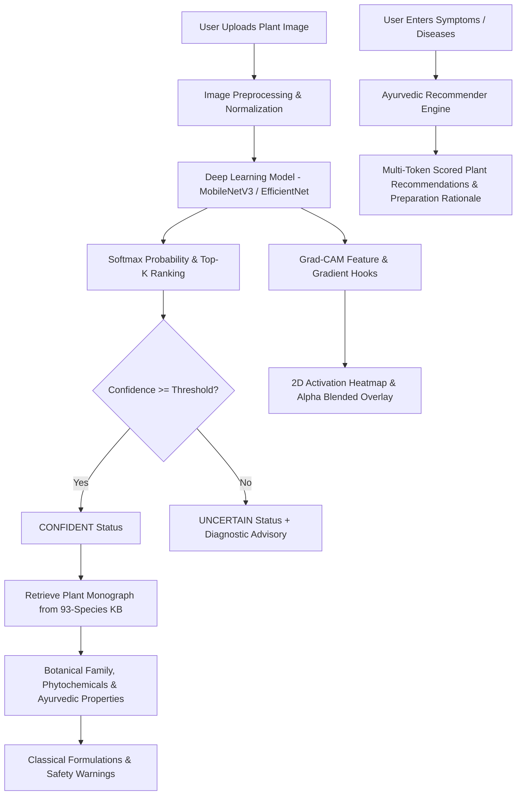

# Deep Learning-Based Indian Medicinal Plant Identification with Explainable AI (Grad-CAM), Confidence-Aware Prediction, and Disease/Symptom-Based Recommendations


-ee4c2c.svg)

-purple.svg)


## 📌 Project Overview

This repository houses an end-to-end deep learning system designed for the **7th-semester B.Tech Computer Science academic project (2026–2027)**. The application identifies selected Indian medicinal plants from **leaf or whole-plant images** across **93 botanical species** (comprising 33,128 authentic images), providing transparency through **Grad-CAM Explainable AI (XAI)**, enforcing clinical reliability via **confidence-aware decision thresholds**, and linking classifications to a **structured Ayurvedic Pharmacopoeia** and an intelligent **disease/symptom-based herbal recommender**.

---

## 🌟 Key Highlights & System Architecture



### 1. Dynamic 93-Species Botanical Pipeline
- Scans and maps 93 Indian medicinal species (e.g. *Withania somnifera* [Ashwagandha], *Ocimum sanctum* [Tulsi], *Curcuma longa* [Haldi], *Terminalia arjuna*, *Bacopa monnieri* [Brahmi]).
- Non-destructive stratified **70% Training (20,253 images) / 15% Validation (3,575 images) / 15% Test (9,300 images)** split manifests with fixed random seed (`seed=42`).
- Corrupted file detection and automated RGB normalization.

### 2. Deep Transfer Learning with CUDA Acceleration
- Backbone: **MobileNetV3-Large** (lightweight, high throughput) with configurable support for **EfficientNet-B0** and **ResNet-50**.
- Multi-stage transfer learning: frozen backbone warmup followed by upper convolutional layer fine-tuning.
- Mixed precision training with `torch.amp.autocast` on NVIDIA GeForce RTX 3050.

### 3. Explainable AI: Native Grad-CAM
- Hooks into the final convolutional layer (`features[-1]`).
- Calculates pooled gradients $\alpha_k^c = \frac{1}{Z} \sum_{i,j} \frac{\partial y^c}{\partial A_{i,j}^k}$ to weight feature activations.
- Generates high-resolution OpenCV Jet heatmaps and alpha-blended overlays, allowing users to verify which morphological regions (e.g., leaf venation, serrations, petioles) drove the prediction.
- Interactive opacity slider in the frontend for live blending.

### 4. Confidence-Aware Decision Thresholds
- Softmax probability evaluated against a configurable threshold $\tau$ (default: `70%`).
- Predictions $\ge \tau$ are classified as **CONFIDENT**.
- Predictions $< \tau$ are flagged as **UNCERTAIN**, with an advisory warning instructing the user to retake the photo with clearer lighting and centered focus.

### 5. Structured 93-Species Ayurvedic Knowledge Base
- Curated JSON database (`backend/knowledge_base/plants_kb.json`) covering:
  - Botanical name and plant family
  - Vernacular names (English, Hindi, Sanskrit, Regional)
  - Plant parts used (Leaf, Root, Bark, Fruit, Whole Plant)
  - Active phytochemical constituents (e.g. Withanolides, Curcumin, Eugenol)
  - Classical Ayurvedic properties (Rasa, Guna, Virya, Vipaka, Dosha karma)
  - Standard formulations (Churna, Kwatha, Asava, Taila) and dosages
  - Safety precautions and contraindications

### 6. Ayurvedic Disease & Symptom Recommender
- Multi-token semantic search matching symptoms and diseases (e.g., "cough and cold", "joint pain arthritis", "diabetes blood sugar", "insomnia and stress") against indications and bodily systems.
- Relevance score ranking ($0-100\%$) with explicit match rationale tags and safety warnings.

---

## 📂 Project Structure

```text
medicinal-plant-ai/
│
├── dataset_manifests/          # Stratified split manifests (train, val, test)
│   ├── dataset_stats.json
│   ├── train_manifest.json     # 20,253 images (70%)
│   ├── val_manifest.json       # 3,575 images (15%)
│   └── test_manifest.json      # 9,300 images (15%)
│
├── notebooks/                  # 5 Academic Jupyter Notebooks
│   ├── 01_dataset_analysis.ipynb
│   ├── 02_preprocessing.ipynb
│   ├── 03_model_training.ipynb
│   ├── 04_model_evaluation.ipynb
│   └── 05_gradcam_testing.ipynb
│
├── src/                        # Core ML Modules
│   ├── dataset.py              # Dynamic scanner, transforms, PyTorch Dataset
│   ├── model.py                # MobileNetV3 / EfficientNet / ResNet50 factory
│   ├── gradcam.py              # Pure PyTorch Grad-CAM computation & visualization
│   ├── train.py                # Mixed precision training loop with callbacks
│   └── evaluate.py             # Test benchmark, precision/recall/F1, confusion matrix
│
├── backend/                    # FastAPI Web Server
│   ├── app.py                  # Server entry point
│   ├── config.py               # Paths and runtime defaults
│   ├── routes/
│   │   └── api.py              # /api/predict, /api/recommend, /api/plants, /api/stats
│   ├── services/
│   │   ├── inference_service.py # Confidence-aware inference + Grad-CAM
│   │   └── recommender_service.py # Ayurvedic symptom search engine
│   └── knowledge_base/
│       └── plants_kb.json      # 93-Species Ayurvedic & botanical monographs
│
├── frontend/                   # Modern Web UI (Glassmorphic Emerald Dark Mode)
│   ├── index.html              # Single page application with 4 tabs
│   ├── css/
│   │   └── styles.css          # Design system & responsive styles
│   └── js/
│       ├── app.js              # Orchestrator & API client
│       ├── xai_viewer.js       # Grad-CAM view modes & live opacity blend
│       └── recommender.js      # Symptom chips & recommendation cards
│
├── saved_models/               # Checkpoints and class mappings
│   ├── class_to_idx.json
│   ├── idx_to_class.json
│   ├── class_metadata.json
│   └── best_plant_model.pth    # Best trained PyTorch model
│
├── outputs/                    # Visualizations & Academic Metrics
│   ├── confusion_matrix/
│   │   └── confusion_matrix.png
│   ├── training_plots/
│   │   └── training_curves.png
│   ├── test_metrics.json
│   └── per_class_metrics.csv
│
├── requirements.txt
└── README.md
```

---

## 🚀 Quickstart & Installation

### 1. Clone & Install Dependencies
```bash
git clone <repo-url>
cd mainpojectD7
pip install -r requirements.txt
```

### 2. Verify GPU Acceleration
```bash
python -c "import torch; print('CUDA Available:', torch.cuda.is_available(), 'Device:', torch.cuda.get_device_name(0))"
```

### 3. Launch the Web Application
```bash
python -m uvicorn backend.app:app --host 127.0.0.1 --port 8000 --reload
```
Open your browser at **[http://localhost:8000](http://localhost:8000)**.

---

## 🎓 Academic Viva Voce Defense Guide

| Question | Answer & Academic Justification |
| :--- | :--- |
| **Q1: Why choose MobileNetV3-Large as the baseline?** | MobileNetV3 utilizes hard-swish non-linearities and lightweight depthwise separable convolutions with Squeeze-and-Excitation (SE) blocks, achieving top accuracy with only ~5.4M parameters, making it ideal for real-time edge and mobile inference while supporting direct Grad-CAM backpropagation. |
| **Q2: How does Grad-CAM differ from vanilla CAM?** | Vanilla CAM requires a Global Average Pooling layer directly connected to the final softmax layer, forcing network architecture redesign. Grad-CAM overcomes this restriction by computing gradients with respect to any chosen feature map layer. |
| **Q3: Why not accept every prediction above 50%?** | In multiclass problems (93 classes), an uncalibrated softmax distribution can distribute probabilities across similar species. A configurable threshold (e.g. 70%) ensures clinical safety, rejecting ambiguous images as *UNCERTAIN*. |
| **Q4: How does the system handle class imbalance?** | Manifests are constructed using stratified random sampling (`stratify=labels`), preserving the exact class proportion across train, validation, and test splits. Label smoothing cross-entropy is also utilized. |

---

## 📜 Academic Declaration
This project is developed as part of the **B.Tech 7th Semester Capstone Project (2026–2027)** in Computer Science and Engineering.
